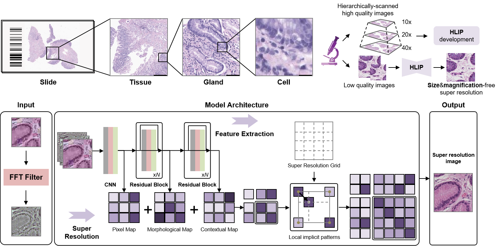

## Super resolution of pathology images with hierarchical feature integration and local image patterns
HLIP is a novel Hierarchical super resolution deep learning framework based on Local Image Patterns. The code for inference is deposited in demo.ipynb

The source code will be released after publication.